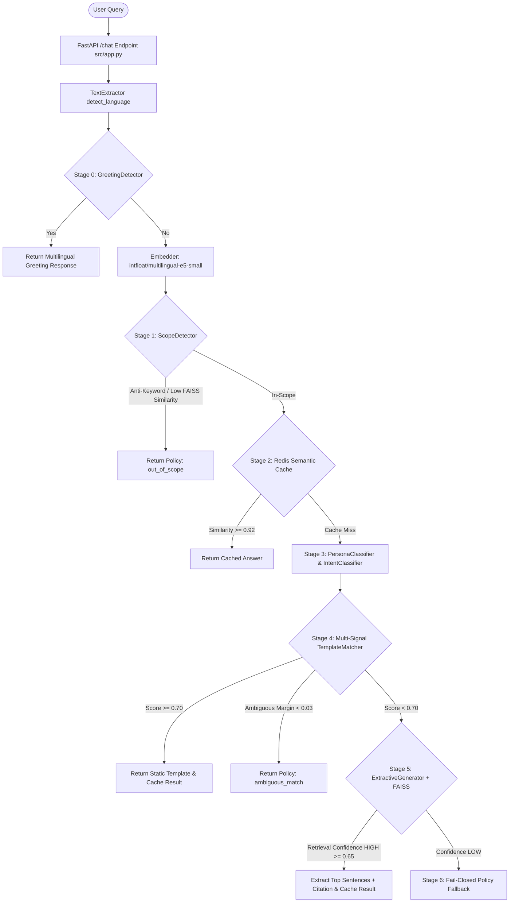

# Kaushal-Dost UPSDM RAG Chatbot: In-Depth Codebase & Architecture Guide

## 1. Executive Summary & High-Level Architecture

The **Kaushal-Dost RAG Chatbot** is an enterprise-grade, CPU-optimized Retrieval-Augmented Generation (RAG) and multi-stage intent-routing system built specifically for the **Uttar Pradesh Skill Development Mission (UPSDM)**. 

### Core Design Philosophy
1. **CPU-First & Low-Latency Execution**: Operates ultra-fast (~5ms to ~40ms for non-LLM paths) without requiring expensive GPU infrastructure.
2. **Zero-Hallucination & Deterministic Factual Accuracy**: Employs a multi-stage deterministic fallback cascade (Greetings $\rightarrow$ Scope Detection $\rightarrow$ Semantic Cache $\rightarrow$ Persona/Intent Classification $\rightarrow$ Template Matching $\rightarrow$ FAISS Extractive QA $\rightarrow$ Fail-Closed Policy Fallback).
3. **Multilingual Support**: Natively handles English, Devanagari Hindi, and Romanized Hinglish using multilingual embeddings (`intfloat/multilingual-e5-small`).
4. **C# API Contract Compliance**: Built as a FastAPI backend engineered to integrate with a C# front-facing middleware, complete with regex-based security filters preventing XSS / script injections.

---

### End-to-End System Architecture



---

## 2. Directory Tree Map

```
Kaushal-Dost---RAG-Chatbot/
├── .dockerignore
├── .dockerignore.bak
├── .gitignore
├── Dockerfile
├── README.md
├── README_HANDOFF.md
├── SCOPE.md
├── VERIFICATION_REPORT.md
├── answers.md
├── docker-compose.yml
├── integration_notes.md
├── pipeline_testing_guide.md
├── requirements.txt
├── chatbot_config/
│   ├── approved_domains.json
│   ├── static_knowledge.yaml
│   ├── system_prompt.yaml
│   └── thresholds.yaml
├── data/
│   ├── chunks.jsonl
│   ├── raw_pages.jsonl
│   ├── seed_supplements.jsonl
│   └── faiss_index/
│       ├── index.bin
│       └── metadata.json
├── reports/
│   ├── crawl_report.md
│   └── routing.jsonl
├── scripts/
│   ├── build_index.py
│   ├── demo_router.py
│   ├── eval_pipeline.py
│   ├── eval_retrieval.py
│   ├── interactive_chat.py
│   ├── load_test.py
│   ├── merge_seeds.py
│   ├── run_crawler.py
│   ├── test_integration_fallback.py
│   ├── test_llm_generation.py
│   └── test_question_bank.py
├── src/
│   ├── __init__.py
│   ├── app.py
│   ├── config.py
│   ├── api/
│   │   └── __init__.py
│   ├── embeddings/
│   │   ├── __init__.py
│   │   ├── embed.py
│   │   └── faiss_index.py
│   ├── ingestion/
│   │   ├── __init__.py
│   │   ├── change_detector.py
│   │   ├── chunker.py
│   │   ├── spider.py
│   │   └── text_extractor.py
│   ├── llm/
│   │   ├── __init__.py
│   │   └── generator.py
│   └── routing/
│       ├── __init__.py
│       ├── confidence.py
│       ├── router.py
│       ├── scope_detector.py
│       ├── static_lookup.py
│       ├── evaluation/
│       │   └── evaluator.py
│       ├── extractive/
│       │   └── extractive_generator.py
│       ├── greetings/
│       │   └── greeting_detector.py
│       ├── intent/
│       │   └── intent_classifier.py
│       ├── persona/
│       │   └── persona_classifier.py
│       ├── sanitizer/
│       │   └── sanitizer.py
│       └── template_matching/
│           └── template_matcher.py
└── tests/
    ├── __init__.py
    ├── eval_set.csv
    ├── test_change_detection.py
    ├── test_contract.py
    ├── test_generator.py
    ├── test_question_bank_hit.py
    ├── test_question_bank_miss.py
    ├── test_redesigned_router.py
    └── test_router.py
```

---

## 3. In-Depth Explanation of Every File

Below is a granular breakdown of every file across the entire repository.

---

### Root Configuration & Containerization Files

#### 1. [Dockerfile](file:///Users/ommakhija/Downloads/kaushal%20dost/Kaushal-Dost---RAG-Chatbot/Dockerfile)
- **What it was made for**: Containerizes the Python FastAPI RAG chatbot service into an isolated, reproducible OCI container image.
- **What it does**: Sets up a Python 3.11-slim base environment, installs C++ build dependencies (`build-essential`), pre-installs CPU PyTorch from the official PyTorch wheel repository, installs dependencies from `requirements.txt`, copies application code, and starts Uvicorn.
- **How it does it**:
  - Uses multi-stage caching rules: `RUN pip install --no-cache-dir torch --index-url https://download.pytorch.org/whl/cpu` runs before `requirements.txt` to avoid re-downloading PyTorch on code changes.
  - Exposes port `8000` and executes `uvicorn src.app:app --host 0.0.0.0 --port 8000`.

#### 2. [docker-compose.yml](file:///Users/ommakhija/Downloads/kaushal%20dost/Kaushal-Dost---RAG-Chatbot/docker-compose.yml)
- **What it was made for**: Orchestrates the multi-container production stack (Redis, Ollama, Model Initializer, FastAPI Brain).
- **What it does**: Defines 4 interconnected services:
  1. `redis`: Redis 7.0 Alpine instance for semantic caching.
  2. `ollama`: Ollama LLM engine for optional LLM generation.
  3. `model-setup`: A lightweight `curl` container that polls Ollama and automatically pulls required models (`qwen3:0.6b` and `qwen3:1.7b`).
  4. `rag-chatbot-brain`: The FastAPI Python app building from `./Dockerfile`.
- **How it does it**: Sets up internal network links and volume mounts (`redis_data`, `ollama_data`, and `~/.cache/huggingface`), ensuring environment variables (`REDIS_HOST=redis`, `OLLAMA_HOST=http://ollama:11434`) wire the services seamlessly.

#### 3. [requirements.txt](file:///Users/ommakhija/Downloads/kaushal%20dost/Kaushal-Dost---RAG-Chatbot/requirements.txt)
- **What it was made for**: Specifies exact Python library dependencies required to build and execute the system.
- **What it does**: Pins versions for Web (FastAPI, Uvicorn, Scrapy, httpx), NLP/Embeddings (sentence-transformers, faiss-cpu, numpy), Extraction (trafilatura, PyMuPDF, pdfplumber, pytesseract, Pillow, beautifulsoup4), Cache (redis), Utilities (pyyaml, pydantic, langdetect), and Testing (pytest, pytest-asyncio).

#### 4. [.dockerignore](file:///Users/ommakhija/Downloads/kaushal%20dost/Kaushal-Dost---RAG-Chatbot/.dockerignore) & [.dockerignore.bak](file:///Users/ommakhija/Downloads/kaushal%20dost/Kaushal-Dost---RAG-Chatbot/.dockerignore.bak)
- **What it was made for**: Prevents unnecessary files, virtual environments, build caches, and sensitive local secrets from being copied into the Docker build context.
- **What it does**: Excludes `.venv`, `__pycache__`, `.git`, `.vscode`, `.pytest_cache`, `.env`, `node_modules`, `dist`, and `build`.

#### 5. [.gitignore](file:///Users/ommakhija/Downloads/kaushal%20dost/Kaushal-Dost---RAG-Chatbot/.gitignore)
- **What it was made for**: Prevents untracked virtual environments, OS metadata files (`.DS_Store`), temporary data caches, SQLite databases (`data/ingestion_state.db`), and logs from being committed to Git.

---

### Root Documentation & Assessment Reports

#### 6. [README.md](file:///Users/ommakhija/Downloads/kaushal%20dost/Kaushal-Dost---RAG-Chatbot/README.md)
- **What it was made for**: Provides a quick introductory landing title for the repository.

#### 7. [README_HANDOFF.md](file:///Users/ommakhija/Downloads/kaushal%20dost/Kaushal-Dost---RAG-Chatbot/README_HANDOFF.md)
- **What it was made for**: Comprehensive developer handoff documentation summarizing the production design overhaul, architecture transition to CPU-first zero-LLM routing, testing results, and startup instructions.

#### 8. [SCOPE.md](file:///Users/ommakhija/Downloads/kaushal%20dost/Kaushal-Dost---RAG-Chatbot/SCOPE.md)
- **What it was made for**: Defines the official boundary specifications for the UPSDM domain, acceptable queries, and anti-scope topics (e.g. general knowledge, non-UPSDM government programs, foreign countries).

#### 9. [VERIFICATION_REPORT.md](file:///Users/ommakhija/Downloads/kaushal%20dost/Kaushal-Dost---RAG-Chatbot/VERIFICATION_REPORT.md)
- **What it was made for**: Audit document detailing unit test execution, pipeline latency measurements, accuracy benchmarks across 26 test questions, and C# contract validation.

#### 10. [answers.md](file:///Users/ommakhija/Downloads/kaushal%20dost/Kaushal-Dost---RAG-Chatbot/answers.md)
- **What it was made for**: Comprehensive technical evaluation report containing benchmark tables, latency breakdowns, and detailed answers to architectural questions regarding the CPU-first pipeline redesign.

#### 11. [integration_notes.md](file:///Users/ommakhija/Downloads/kaushal%20dost/Kaushal-Dost---RAG-Chatbot/integration_notes.md)
- **What it was made for**: Specifies integration requirements between the Python FastAPI backend and external C# middleware, detailing payload schemas, HTTP error codes, and XSS sanitization constraints.

#### 12. [pipeline_testing_guide.md](file:///Users/ommakhija/Downloads/kaushal%20dost/Kaushal-Dost---RAG-Chatbot/pipeline_testing_guide.md)
- **What it was made for**: Hands-on guide for developers to run crawlers, rebuild vector indices, execute pytest suites, run load tests, and test individual API endpoints.

---

### Configuration Files (`chatbot_config/`)

#### 13. [approved_domains.json](file:///Users/ommakhija/Downloads/kaushal%20dost/Kaushal-Dost---RAG-Chatbot/chatbot_config/approved_domains.json)
- **What it was made for**: Configures domain whitelist for the web crawler.
- **What it does**: Restricts Scrapy crawling exclusively to approved domains: `upsdm.gov.in`, `www.upsdm.gov.in`, `kaushaldrishti.upsdm.gov.in`.

#### 14. [static_knowledge.yaml](file:///Users/ommakhija/Downloads/kaushal%20dost/Kaushal-Dost---RAG-Chatbot/chatbot_config/static_knowledge.yaml)
- **What it was made for**: Curated static knowledge base for Stage 0 (Instant Lookup) and Stage 4 (Template Matching).
- **What it does**: Stores clean, structured Q&A entries tagged by `persona` (Student, Training Partner, Industrial Partner, Assessment Agency, General Public) and `intent` (Helpline, Enroll, Infrastructure, Reimbursement, etc.), complete with aliases in English and Devanagari Hindi.

#### 15. [system_prompt.yaml](file:///Users/ommakhija/Downloads/kaushal%20dost/Kaushal-Dost---RAG-Chatbot/chatbot_config/system_prompt.yaml)
- **What it was made for**: Centralized store for system prompt templates, banned words, greeting responses, and fallback responses.
- **What it does**: Supplies language-specific greeting strings (English/Hindi), fallback policy text, and banned word substitution rules.

#### 16. [thresholds.yaml](file:///Users/ommakhija/Downloads/kaushal%20dost/Kaushal-Dost---RAG-Chatbot/chatbot_config/thresholds.yaml)
- **What it was made for**: Central control panel for all algorithmic thresholds, weights, and timeout parameters across the entire system.
- **What it does**: Configures:
  - `retrieval`: FAISS top_k=5, high_confidence=0.88, medium_confidence=0.62, weights for composite scoring.
  - `cache`: similarity_threshold=0.92, ttl_seconds=3600, max_entries=10000.
  - `scope`: similarity_threshold=0.45, anti_scope_keywords.
  - `routing`: persona_threshold=0.50, intent_threshold=0.50, template_threshold=0.70, ambiguity_margin=0.03, extraction_threshold=0.65.
  - `llm`: primary_model="qwen3:0.6b", fallback_model="qwen3:1.7b", max_concurrent=4, timeout_seconds=180.

---

### Data & Storage Files (`data/` & `reports/`)

#### 17. [data/raw_pages.jsonl](file:///Users/ommakhija/Downloads/kaushal%20dost/Kaushal-Dost---RAG-Chatbot/data/raw_pages.jsonl)
- **What it was made for**: Raw output file produced by Scrapy spider.
- **What it does**: Contains raw crawled HTML pages and base64-encoded PDF files directly fetched from `upsdm.gov.in`.

#### 18. [data/chunks.jsonl](file:///Users/ommakhija/Downloads/kaushal%20dost/Kaushal-Dost---RAG-Chatbot/data/chunks.jsonl)
- **What it was made for**: Primary cleaned and chunked text dataset.
- **What it does**: Stores sentence-boundary-aligned text chunks (~500 tokens) with metadata (`chunk_id`, `source_url`, `hash_sha256`, `language`, `last_crawled`).

#### 19. [data/seed_supplements.jsonl](file:///Users/ommakhija/Downloads/kaushal%20dost/Kaushal-Dost---RAG-Chatbot/data/seed_supplements.jsonl)
- **What it was made for**: Hand-curated seed data for pages that render via client-side JavaScript or dynamic portals (e.g. Kaushal Drishti portal details).
- **What it does**: Provides structured chunks appended into `chunks.jsonl` via `scripts/merge_seeds.py`.

#### 20. [data/faiss_index/index.bin](file:///Users/ommakhija/Downloads/kaushal%20dost/Kaushal-Dost---RAG-Chatbot/data/faiss_index/index.bin) & [metadata.json](file:///Users/ommakhija/Downloads/kaushal%20dost/Kaushal-Dost---RAG-Chatbot/data/faiss_index/metadata.json)
- **What it was made for**: Binary vector index and metadata mapping file for fast nearest-neighbor retrieval.
- **What it does**: `index.bin` contains 384-dimensional normalized E5 embeddings indexed via `faiss.IndexFlatIP`. `metadata.json` maps array indices (0 to N-1) back to full chunk dicts.

#### 21. [reports/crawl_report.md](file:///Users/ommakhija/Downloads/kaushal%20dost/Kaushal-Dost---RAG-Chatbot/reports/crawl_report.md) & [reports/routing.jsonl](file:///Users/ommakhija/Downloads/kaushal%20dost/Kaushal-Dost---RAG-Chatbot/reports/routing.jsonl)
- **What it was made for**: Audit logs and metric summaries.
- **What it does**: `crawl_report.md` tracks crawl dates, page counts, PDF counts, and language breakdowns. `routing.jsonl` appends real-time JSON log entries for every query processed through `Router`.

---

### Core Source Code (`src/`)

#### 22. [src/__init__.py](file:///Users/ommakhija/Downloads/kaushal%20dost/Kaushal-Dost---RAG-Chatbot/src/__init__.py)
- Marks `src` as a Python package.

#### 23. [src/config.py](file:///Users/ommakhija/Downloads/kaushal%20dost/Kaushal-Dost---RAG-Chatbot/src/config.py)
- **What it was made for**: Centralized singleton configuration provider loading JSON and YAML files from `chatbot_config/`.
- **What it does**: Provides typed properties (`approved_domains`, `retrieval_thresholds`, `cache_config`, `llm_config`, `static_knowledge`, `system_prompt`) so modules access uniform settings.
- **How it does it**: Instantiates a global `Config` object cached via `load_config()`.

#### 24. [src/app.py](file:///Users/ommakhija/Downloads/kaushal%20dost/Kaushal-Dost---RAG-Chatbot/src/app.py)
- **What it was made for**: Main FastAPI Web API server handling incoming chat requests.
- **What it does**: Exposes `/chat` (POST) and `/health` (GET) endpoints. Receives user message and chat history, routes query through `Router`, tracks overall end-to-end latency, logs metrics in JSON, and returns structured `ChatResponse`.
- **How it does it**: Uses Pydantic models (`ChatRequest`, `ChatResponse`, `ChatMessage`). Handles exceptions gracefully, passing standard HTTP status codes (e.g. 503 on concurrency overload).

---

### Vector Embeddings (`src/embeddings/`)

#### 25. [src/embeddings/__init__.py](file:///Users/ommakhija/Downloads/kaushal%20dost/Kaushal-Dost---RAG-Chatbot/src/embeddings/__init__.py)
- Package marker.

#### 26. [src/embeddings/embed.py](file:///Users/ommakhija/Downloads/kaushal%20dost/Kaushal-Dost---RAG-Chatbot/src/embeddings/embed.py)
- **What it was made for**: Encapsulates embedding generation using `SentenceTransformer`.
- **What it does**: Loads `intfloat/multilingual-e5-small` (~118MB, 384 dimensions). Prepares text with E5 prefixes (`passage: ` for text chunks, `query: ` for user queries) and outputs normalized `float32` vector arrays.
- **How it does it**: Calls `self.model.encode(texts, normalize_embeddings=True)`.

#### 27. [src/embeddings/faiss_index.py](file:///Users/ommakhija/Downloads/kaushal%20dost/Kaushal-Dost---RAG-Chatbot/src/embeddings/faiss_index.py)
- **What it was made for**: Manages FAISS vector indexing, disk persistence, and similarity search.
- **What it does**: Uses `faiss.IndexFlatIP` (Inner Product). With unit-normalized vectors, Inner Product is mathematical cosine similarity.
- **How it does it**:
  - `build(embeddings, metadata)`: Adds vectors to FAISS index and writes `index.bin` and `metadata.json`.
  - `search(query_embedding, top_k)`: Executes vector search in sub-millisecond latency, attaching similarity score `score` to retrieved metadata dicts.

---

### Document Ingestion & Pipeline Processing (`src/ingestion/`)

#### 28. [src/ingestion/__init__.py](file:///Users/ommakhija/Downloads/kaushal%20dost/Kaushal-Dost---RAG-Chatbot/src/ingestion/__init__.py)
- Package marker.

#### 29. [src/ingestion/spider.py](file:///Users/ommakhija/Downloads/kaushal%20dost/Kaushal-Dost---RAG-Chatbot/src/ingestion/spider.py)
- **What it was made for**: Scrapy Web Spider for crawling UPSDM web pages and downloadable PDFs.
- **What it does**: Respects `robots.txt`, obeys domain boundaries (`approved_domains.json`), extracts internal links up to `DEPTH_LIMIT=1`, and writes HTML/PDF objects to `data/raw_pages.jsonl`.
- **How it does it**: PDF raw bytes are encoded into `base64` strings inside JSON objects to ensure safe storage.

#### 30. [src/ingestion/text_extractor.py](file:///Users/ommakhija/Downloads/kaushal%20dost/Kaushal-Dost---RAG-Chatbot/src/ingestion/text_extractor.py)
- **What it was made for**: Multilingual text extraction and language detection.
- **What it does**:
  - `extract_html()`: Uses `trafilatura` to strip nav/footer boilerplate, and `BeautifulSoup` to extract actionable buttons, links, and form inputs.
  - `extract_pdf()`: Uses `PyMuPDF` (fitz) for text PDFs. If text yield is low (<50 chars/page), falls back to `pdfplumber` + `pytesseract` OCR (English + Hindi `eng+hin`).
  - `detect_language()`: Uses Devanagari regex range (`\u0900-\u097F`) and English character checks to categorize language as `en`, `hi`, or `mixed`.

#### 31. [src/ingestion/chunker.py](file:///Users/ommakhija/Downloads/kaushal%20dost/Kaushal-Dost---RAG-Chatbot/src/ingestion/chunker.py)
- **What it was made for**: Text chunking with sentence-boundary alignment.
- **What it does**: Splits documents into chunks (~500 tokens, 50 token overlap). Preserves FAQ question-answer pairs intact by recognizing numbered lists (`1. `, `2. `).
- **How it does it**: Generates SHA-256 hashes for each chunk (`hash_sha256`) and attaches rich metadata (`chunk_id`, `source_url`, `language`, `last_crawled`, `word_count`).

#### 32. [src/ingestion/change_detector.py](file:///Users/ommakhija/Downloads/kaushal%20dost/Kaushal-Dost---RAG-Chatbot/src/ingestion/change_detector.py)
- **What it was made for**: Incremental re-indexing change tracking via SQLite database (`data/ingestion_state.db`).
- **What it does**: Tracks `source_id`, SHA-256 source content hash, version numbers, and timestamps (`first_seen`, `last_seen`, `last_changed`). Categorizes sources into `new`, `changed`, and `unchanged` to prevent redundant vector re-embedding.

---

### LLM Generation Engine (`src/llm/`)

#### 33. [src/llm/__init__.py](file:///Users/ommakhija/Downloads/kaushal%20dost/Kaushal-Dost---RAG-Chatbot/src/llm/__init__.py)
- Package marker.

#### 34. [src/llm/generator.py](file:///Users/ommakhija/Downloads/kaushal%20dost/Kaushal-Dost---RAG-Chatbot/src/llm/generator.py)
- **What it was made for**: Asynchronous local LLM inference client via Ollama HTTP API.
- **What it does**: Generates synthesized RAG answers when explicitly invoked. Enforces concurrency limits (`asyncio.Semaphore(4)`) and queue capacity limits (`queue_size=100`, rejecting with HTTP 503 when full).
- **How it does it**:
  - Sends requests to Ollama `/api/chat` with `/no_think` directive (suppressing chain-of-thought overhead in Qwen3).
  - Uses primary model (`qwen3:0.6b`), automatically falling back to secondary model (`qwen3:1.7b`) on timeout/error.

---

### Multi-Stage Routing Pipeline (`src/routing/`)

#### 35. [src/routing/__init__.py](file:///Users/ommakhija/Downloads/kaushal%20dost/Kaushal-Dost---RAG-Chatbot/src/routing/__init__.py)
- Package marker.

#### 36. [src/routing/router.py](file:///Users/ommakhija/Downloads/kaushal%20dost/Kaushal-Dost---RAG-Chatbot/src/routing/router.py)
- **What it was made for**: Core orchestrator connecting all 6 routing stages, Redis cache, and FAISS vector index.
- **What it does**:
  1. Detects language.
  2. **Stage 0**: Calls `GreetingDetector`.
  3. Computes query embedding via `Embedder`.
  4. **Stage 1**: Performs FAISS top-3 search & evaluates `ScopeDetector`.
  5. **Stage 2**: Checks Redis Semantic Cache (`check_semantic_cache`).
  6. **Stage 3**: Classifies persona (`PersonaClassifier`) and intent (`IntentClassifier`).
  7. **Stage 4**: Evaluates `TemplateMatcher`. If hit, stores response in Redis and returns.
  8. **Stage 5**: Computes retrieval confidence (`ExtractiveGenerator`). If HIGH, extracts factual sentences and returns.
  9. **Stage 6**: Returns fail-closed policy fallback (`out_of_scope`, `fallback`, `ambiguous_match`, `low_confidence`).
- **How it does it**: Maintains in-memory cache arrays (`cached_queries`, `cached_embeddings`) synchronized with Redis for vector matching ($>0.92$ threshold). Appends audit metrics to `reports/routing.jsonl`.

#### 37. [src/routing/scope_detector.py](file:///Users/ommakhija/Downloads/kaushal%20dost/Kaushal-Dost---RAG-Chatbot/src/routing/scope_detector.py)
- **What it was made for**: Stage 1 lightweight scope filter (<1ms CPU overhead).
- **What it does**: Instantly rejects out-of-scope queries.
- **How it does it**:
  - Checks anti-scope keywords (e.g. `france`, `australia`, `cricket`, `weather`).
  - Checks if top FAISS similarity score $< 0.45$.

#### 38. [src/routing/static_lookup.py](file:///Users/ommakhija/Downloads/kaushal%20dost/Kaushal-Dost---RAG-Chatbot/src/routing/static_lookup.py)
- **What it was made for**: Instant string-matching lookup engine (<10ms).
- **What it does**: Performs exact match, substring inclusion, and fuzzy sequence matching (`difflib.SequenceMatcher`, threshold 0.80) against static knowledge aliases without needing embeddings.

#### 39. [src/routing/confidence.py](file:///Users/ommakhija/Downloads/kaushal%20dost/Kaushal-Dost---RAG-Chatbot/src/routing/confidence.py)
- **What it was made for**: Multi-signal retrieval confidence evaluator.
- **What it does**: Calculates a composite confidence score from FAISS search results based on 3 signals:
  $$\text{Composite} = 0.50 \cdot \text{top\_score} + 0.30 \cdot \left(\frac{\text{score\_gap}}{0.3}\right) + 0.20 \cdot \text{avg\_top\_k}$$
- **How it does it**: Categorizes confidence into `HIGH` ($\ge 0.88$), `MEDIUM` ($\ge 0.62$), or `LOW`. Contains static cleaner `format_extractive_answer()`.

#### 40. [src/routing/greetings/greeting_detector.py](file:///Users/ommakhija/Downloads/kaushal%20dost/Kaushal-Dost---RAG-Chatbot/src/routing/greetings/greeting_detector.py)
- **What it was made for**: Stage 0 multilingual greeting detection.
- **What it does**: Identifies greetings in English, Latin Hindi (e.g. `namaste`, `pranam`), and Devanagari Hindi (e.g. `नमस्ते`, `जय श्री राम`).
- **How it does it**: Normalizes punctuation and checks word token sets. Returns language-appropriate greeting strings.

#### 41. [src/routing/persona/persona_classifier.py](file:///Users/ommakhija/Downloads/kaushal%20dost/Kaushal-Dost---RAG-Chatbot/src/routing/persona/persona_classifier.py)
- **What it was made for**: Classifies queries into 6 user personas: `Student`, `Training Partner`, `Industrial Partner`, `Assessment Agency`, `General Public`, `Unknown`.
- **What it does**: Combines strong rule overrides, keyword matches, and cosine similarity against pre-embedded exemplar vectors:
  $$\text{Score} = 0.40 \cdot \text{kw\_score} + 0.60 \cdot \text{semantic\_score}$$

#### 42. [src/routing/intent/intent_classifier.py](file:///Users/ommakhija/Downloads/kaushal%20dost/Kaushal-Dost---RAG-Chatbot/src/routing/intent/intent_classifier.py)
- **What it was made for**: Classifies specific intent within the detected persona namespace (e.g., `Student` $\rightarrow$ `Enroll`, `Certificate`, `Placement`, `Eligibility`, `Training Center`).
- **What it does**: Evaluates keyword overlap and cosine similarity against persona-scoped intent exemplars.

#### 43. [src/routing/template_matching/template_matcher.py](file:///Users/ommakhija/Downloads/kaushal%20dost/Kaushal-Dost---RAG-Chatbot/src/routing/template_matching/template_matcher.py)
- **What it was made for**: Stage 4 multi-signal template match engine with ambiguity detection.
- **What it does**: Calculates a composite score for each candidate static template:
  $$\text{Score} = 0.40 \cdot \text{Embedding} + 0.25 \cdot \text{Keyword} + 0.20 \cdot \text{Intent} + 0.15 \cdot \text{Persona}$$
- **How it does it**:
  - Filters candidate templates by detected persona.
  - If top score $\ge 0.70$ and difference to runner-up $\ge 0.03$, returns `success`.
  - If score difference $< 0.03$, returns `ambiguous`.
  - If top score $< 0.70$, returns `low_confidence`.

#### 44. [src/routing/extractive/extractive_generator.py](file:///Users/ommakhija/Downloads/kaushal%20dost/Kaushal-Dost---RAG-Chatbot/src/routing/extractive/extractive_generator.py)
- **What it was made for**: Stage 5 CPU-only extractive answer generation from FAISS chunks.
- **What it does**:
  - Evaluates 6 retrieval signals (top score, avg top-k, gap, metadata quality, chunk length, source diversity).
  - If composite confidence $\ge 0.65$, splits top FAISS chunks into sentences, embeds each sentence, scores relevance to query ($0.6 \cdot \text{sim} + 0.4 \cdot \text{overlap}$), and stitches top 2-3 sentences together with official source citations.

#### 45. [src/routing/sanitizer/sanitizer.py](file:///Users/ommakhija/Downloads/kaushal%20dost/Kaushal-Dost---RAG-Chatbot/src/routing/sanitizer/sanitizer.py)
- **What it was made for**: Final output text sanitization before sending API response.
- **What it does**: Strips internal debug tags (`[Draft RAG Response]`, `[Debug: ...]`), developer comments (`<!-- ... -->`), leaked JSON brackets, and normalizes extra whitespace.

#### 46. [src/routing/evaluation/evaluator.py](file:///Users/ommakhija/Downloads/kaushal%20dost/Kaushal-Dost---RAG-Chatbot/src/routing/evaluation/evaluator.py)
- **What it was made for**: Evaluation suite measuring routing accuracy and latency metrics.
- **What it does**: Computes persona accuracy, intent accuracy, stage accuracy, P95/avg latency, false positive/negative rates, and confusion matrices over test datasets.

---

### Executable Scripts (`scripts/`)

#### 47. [scripts/run_crawler.py](file:///Users/ommakhija/Downloads/kaushal%20dost/Kaushal-Dost---RAG-Chatbot/scripts/run_crawler.py)
- Executes Scrapy crawler, parses HTML/PDFs via `TextExtractor`, chunks text via `Chunker`, writes `chunks.jsonl`, and generates `reports/crawl_report.md`.

#### 48. [scripts/merge_seeds.py](file:///Users/ommakhija/Downloads/kaushal%20dost/Kaushal-Dost---RAG-Chatbot/scripts/merge_seeds.py)
- Merges supplemental seed entries (`data/seed_supplements.jsonl`) into `data/chunks.jsonl`, skipping duplicates via SHA-256 hashes.

#### 49. [scripts/build_index.py](file:///Users/ommakhija/Downloads/kaushal%20dost/Kaushal-Dost---RAG-Chatbot/scripts/build_index.py)
- Reads `data/chunks.jsonl`, generates 384-dimensional embeddings via `Embedder`, and builds the FAISS vector index (`data/faiss_index/index.bin`).

#### 50. [scripts/demo_router.py](file:///Users/ommakhija/Downloads/kaushal%20dost/Kaushal-Dost---RAG-Chatbot/scripts/demo_router.py)
- Interactive CLI demonstration script allowing developers to type sample queries and view stage-by-stage routing metadata in real time.

#### 51. [scripts/interactive_chat.py](file:///Users/ommakhija/Downloads/kaushal%20dost/Kaushal-Dost---RAG-Chatbot/scripts/interactive_chat.py)
- Command-line interactive terminal chat session connecting directly to the running FastAPI server (`http://localhost:8000/chat`).

#### 52. [scripts/eval_pipeline.py](file:///Users/ommakhija/Downloads/kaushal%20dost/Kaushal-Dost---RAG-Chatbot/scripts/eval_pipeline.py)
- Runs comprehensive offline pipeline evaluation against labeled datasets, generating accuracy reports and latency distribution graphs.

#### 53. [scripts/eval_retrieval.py](file:///Users/ommakhija/Downloads/kaushal%20dost/Kaushal-Dost---RAG-Chatbot/scripts/eval_retrieval.py)
- Evaluates raw FAISS vector retrieval quality (Recall@k, MRR) independently of intent routing.

#### 54. [scripts/load_test.py](file:///Users/ommakhija/Downloads/kaushal%20dost/Kaushal-Dost---RAG-Chatbot/scripts/load_test.py)
- Asynchronous load-testing script sending concurrent HTTP requests to `/chat` to measure throughput, average latency, and P95 response times.

#### 55. [scripts/test_integration_fallback.py](file:///Users/ommakhija/Downloads/kaushal%20dost/Kaushal-Dost---RAG-Chatbot/scripts/test_integration_fallback.py)
- Tests system behavior during external service degradation (e.g. when Redis or Ollama is offline).

#### 56. [scripts/test_llm_generation.py](file:///Users/ommakhija/Downloads/kaushal%20dost/Kaushal-Dost---RAG-Chatbot/scripts/test_llm_generation.py)
- Direct test script for `LLMGenerator`, sending test prompts to Ollama to verify streaming and model responses.

#### 57. [scripts/test_question_bank.py](file:///Users/ommakhija/Downloads/kaushal%20dost/Kaushal-Dost---RAG-Chatbot/scripts/test_question_bank.py)
- Automated verification script executing 26 benchmark test questions across Student, TP, Industrial Partner, and Out-of-Scope categories against `/chat`, displaying comparative output tables.

---

### Unit & Integration Test Suite (`tests/`)

#### 58. [tests/__init__.py](file:///Users/ommakhija/Downloads/kaushal%20dost/Kaushal-Dost---RAG-Chatbot/tests/__init__.py)
- Test package marker.

#### 59. [tests/eval_set.csv](file:///Users/ommakhija/Downloads/kaushal%20dost/Kaushal-Dost---RAG-Chatbot/tests/eval_set.csv)
- Benchmark CSV dataset containing queries, expected personas, expected intents, and ground-truth stages.

#### 60. [tests/test_change_detection.py](file:///Users/ommakhija/Downloads/kaushal%20dost/Kaushal-Dost---RAG-Chatbot/tests/test_change_detection.py)
- Unit tests for `ChangeDetector` SQLite hash state tracking and versioning.

#### 61. [tests/test_contract.py](file:///Users/ommakhija/Downloads/kaushal%20dost/Kaushal-Dost---RAG-Chatbot/tests/test_contract.py)
- Verifies system compliance with C# middleware security regex (`<|>|script|alert|onclick|...`), ensuring no greeting or fallback message contains scripting symbols.

#### 62. [tests/test_generator.py](file:///Users/ommakhija/Downloads/kaushal%20dost/Kaushal-Dost---RAG-Chatbot/tests/test_generator.py)
- Unit tests for `LLMGenerator` context formatting, prompt construction, and concurrency semaphore queueing logic.

#### 63. [tests/test_question_bank_hit.py](file:///Users/ommakhija/Downloads/kaushal%20dost/Kaushal-Dost---RAG-Chatbot/tests/test_question_bank_hit.py)
- Asserts that all standard in-scope UPSDM queries correctly trigger high-confidence routing stages (`static_lookup` or `faiss_direct`).

#### 64. [tests/test_question_bank_miss.py](file:///Users/ommakhija/Downloads/kaushal%20dost/Kaushal-Dost---RAG-Chatbot/tests/test_question_bank_miss.py)
- Asserts that out-of-scope queries (e.g. capital of France) are correctly intercepted by `out_of_scope` policy responses.

#### 65. [tests/test_redesigned_router.py](file:///Users/ommakhija/Downloads/kaushal%20dost/Kaushal-Dost---RAG-Chatbot/tests/test_redesigned_router.py)
- Exhaustive unit test suite covering `GreetingDetector`, `PersonaClassifier`, `IntentClassifier`, `TemplateMatcher`, `ExtractiveGenerator`, `ResponseSanitizer`, and `Router`.

#### 66. [tests/test_router.py](file:///Users/ommakhija/Downloads/kaushal%20dost/Kaushal-Dost---RAG-Chatbot/tests/test_router.py)
- Integration test suite verifying end-to-end `Router.route()` execution with mocked dependencies.

---

## 4. Summary of Pipeline Stages & Performance Benchmarks

| Stage | Name | Key Component | Latency Target | Description |
|---|---|---|---|---|
| **Stage 0** | Multilingual Greeting | `GreetingDetector` | $<5$ ms | Token matching for English & Devanagari/Hinglish greetings |
| **Stage 1** | Scope Detection | `ScopeDetector` | $<10$ ms | Anti-scope keyword check & FAISS similarity threshold ($0.45$) |
| **Stage 2** | Semantic Cache | Redis & In-Memory | $<15$ ms | Cosine similarity against cached query vectors ($\ge 0.92$) |
| **Stage 3** | Persona & Intent | `PersonaClassifier` / `IntentClassifier` | $<25$ ms | Multi-signal classification into 6 user personas and specific intents |
| **Stage 4** | Template Matcher | `TemplateMatcher` | $<35$ ms | Multi-signal template match ($\ge 0.70$) with ambiguity guard |
| **Stage 5** | Extractive RAG | `ExtractiveGenerator` + FAISS | $<40$ ms | CPU sentence extraction from top FAISS passages ($\ge 0.65$) |
| **Stage 6** | Policy Fallback | `Router` Policy Maps | $<5$ ms | Deterministic fail-closed policy responses for low-confidence queries |
