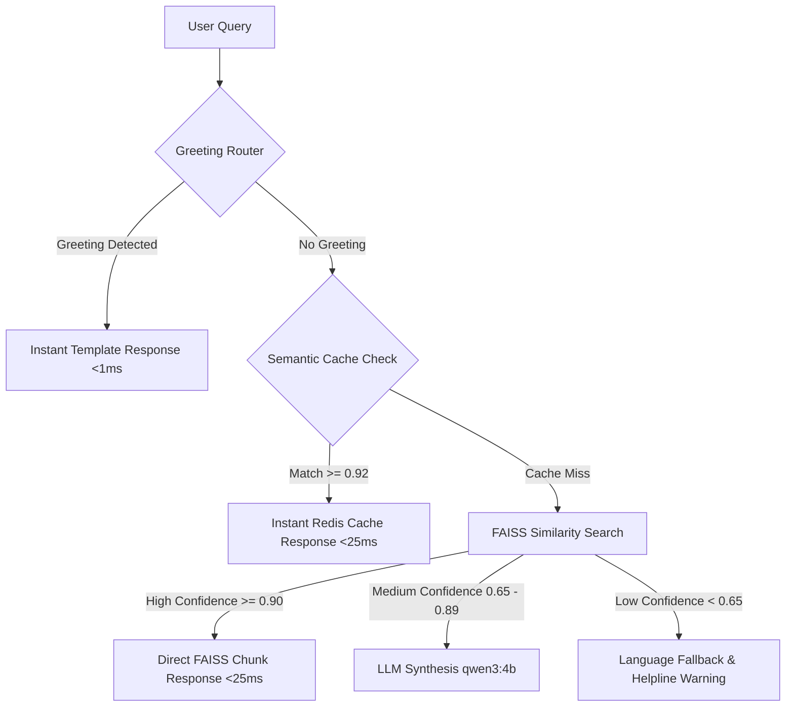

# 🧪 UPSDM RAG Chatbot Pipeline Testing Guide

This guide provides step-by-step instructions to verify, run, and test the multi-stage confidence-routing RAG pipeline of the **Uttar Pradesh Skill Development Mission (UPSDM) Chatbot Brain**. 

The pipeline routes user queries dynamically across four stages based on semantic relevance scores:


---

## 🛠️ Step 1: Local Python Environment & Dependencies

First, set up your local python environment to ensure all scripts and pytest suites can run.

### 🍎 On macOS / Linux
1. **Navigate to the Project Root**:
   ```bash
   cd "/Users/ommakhija/Downloads/kaushal dost/Kaushal-Dost---RAG-Chatbot"
   ```
2. **Activate the Virtual Environment**:
   ```bash
   source .venv/bin/activate
   ```
3. **Install Dependencies**:
   ```bash
   pip install -r requirements.txt
   ```

### 🪟 On Windows
1. **Navigate to the Project Root**:
   * **Command Prompt / PowerShell**:
     ```cmd
     cd "C:\path\to\Kaushal-Dost---RAG-Chatbot"
     ```
2. **Activate the Virtual Environment**:
   * **Command Prompt (cmd.exe)**:
     ```cmd
     .venv\Scripts\activate.bat
     ```
   * **PowerShell**:
     ```powershell
     .venv\Scripts\Activate.ps1
     ```
3. **Install Dependencies**:
   ```cmd
   pip install -r requirements.txt
   ```

---

## 🐳 Step 2: Spin Up the Containerized Stack

Deploy Redis, Ollama, the model setup utility, and the FastAPI RAG service using Docker Compose.

1. **Build and Run the Containers** (All Platforms):
   ```bash
   docker-compose up --build -d
   ```

2. **Verify Containers are Running**:
   Check if the four containers are active:
   ```bash
   docker ps
   ```
   You should see:
   * `upsdm-chatbot-redis` on port `6379`
   * `upsdm-chatbot-ollama` on port `11434`
   * `upsdm-chatbot-model-setup` (terminates once setup completes)
   * `upsdm-chatbot-brain` on port `8000`

3. **Monitor Model Download Progress**:
   The `model-setup` helper downloads the required LLM models (`qwen3:4b` and `qwen3:1.7b`) into the Ollama volume automatically. Watch the logs to confirm completion:
   ```bash
   docker logs -f upsdm-chatbot-model-setup
   ```
   *Expected Output*:
   ```text
   Waiting for Ollama service to start...
   Ollama is online. Pulling primary model: qwen3:4b...
   Pulling fallback model: qwen3:1.7b...
   LLM models successfully pulled and verified!
   ```

> [!NOTE]
> Pulling the models can take several minutes depending on your internet connection speed. Ensure this container successfully exits before performing tests that route to the LLM stage.

---

## 🧪 Step 3: Run the Automated Unit Test Suite

Run the full pytest suite to verify component contracts, routing criteria, and security patterns.

* **macOS / Linux**:
  ```bash
  .venv/bin/pytest tests/
  ```
* **Windows (with active virtualenv)**:
  ```cmd
  pytest tests/
  ```
* **Windows (explicit path)**:
  ```cmd
  .venv\Scripts\pytest tests/
  ```

---

## 💻 Step 4: Run the Standalone Pipeline Demo

The local demo script instantiates the pipeline components and prints out execution logs showing exactly which routing stage was selected for various prompts.

* **macOS / Linux**:
  ```bash
  .venv/bin/python scripts/demo_router.py
  ```
* **Windows (with active virtualenv)**:
  ```cmd
  python scripts/demo_router.py
  ```
* **Windows (explicit path)**:
  ```cmd
  .venv\Scripts\python scripts/demo_router.py
  ```

---

## 🚦 Step 5: Test Concurrency and Queue Limits

The server handles concurrent requests by queuing them or rejecting them instantly under high load to protect local system memory and GPU resources.

* **macOS / Linux**:
  ```bash
  .venv/bin/python scripts/load_test.py
  ```
* **Windows (with active virtualenv)**:
  ```cmd
  python scripts/load_test.py
  ```
* **Windows (explicit path)**:
  ```cmd
  .venv\Scripts\python scripts/load_test.py
  ```

*Expected Result*: Out of 5 concurrent requests fired simultaneously:
* **3 requests** return `HTTP 200` (processed successfully).
* **2 requests** return `HTTP 503` (rejected immediately with a "Service Busy" response).

---

## 🔌 Step 6: Client-Side Failover & Fallback Simulation

The C# `.NET` web integration is configured to fail over gracefully to a legacy SQL keyword matcher if the python FastAPI endpoint goes offline.

* **macOS / Linux**:
  ```bash
  .venv/bin/python scripts/test_integration_fallback.py
  ```
* **Windows (with active virtualenv)**:
  ```cmd
  python scripts/test_integration_fallback.py
  ```
* **Windows (explicit path)**:
  ```cmd
  .venv\Scripts\python scripts/test_integration_fallback.py
  ```

---

## 💡 Step 7: Live API Endpoint Testing

With the Docker containers running (see Step 2), you can test the REST API endpoints.

### 1. System Health Check
Verify the API is healthy and connected to the models:
* **macOS / Linux / Windows cmd.exe**:
  ```bash
  curl -i http://localhost:8000/health
  ```
* **Windows PowerShell**:
  ```powershell
  Invoke-RestMethod -Uri "http://localhost:8000/health" -Method Get
  ```

---

### 2. Multi-Stage Chat Endpoint (`/chat`)

Choose the testing tool based on your command line setup:

#### Test Case A: Greeting Route (Instant)
* **macOS / Linux / Git Bash**:
  ```bash
  curl -i -X POST http://localhost:8000/chat \
    -H "Content-Type: application/json" \
    -d '{"message": "Namaste!", "history": []}'
  ```
* **Windows Command Prompt (cmd.exe)**:
  ```cmd
  curl -i -X POST http://localhost:8000/chat ^
    -H "Content-Type: application/json" ^
    -d "{\"message\": \"Namaste!\", \"history\": []}"
  ```
* **Windows PowerShell**:
  ```powershell
  Invoke-RestMethod -Uri "http://localhost:8000/chat" `
    -Method Post `
    -ContentType "application/json" `
    -Body '{"message": "Namaste!", "history": []}'
  ```

#### Test Case B: FAISS Direct Route (Exact Chunk Match)
* **macOS / Linux / Git Bash**:
  ```bash
  curl -i -X POST http://localhost:8000/chat \
    -H "Content-Type: application/json" \
    -d '{"message": "What is SPMU - State Project Management Unit.", "history": []}'
  ```
* **Windows Command Prompt (cmd.exe)**:
  ```cmd
  curl -i -X POST http://localhost:8000/chat ^
    -H "Content-Type: application/json" ^
    -d "{\"message\": \"What is SPMU - State Project Management Unit.\", \"history\": []}"
  ```
* **Windows PowerShell**:
  ```powershell
  Invoke-RestMethod -Uri "http://localhost:8000/chat" `
    -Method Post `
    -ContentType "application/json" `
    -Body '{"message": "What is SPMU - State Project Management Unit.", "history": []}'
  ```

#### Test Case C: LLM Generation Route (Synthesis)
* **macOS / Linux / Git Bash**:
  ```bash
  curl -i -X POST http://localhost:8000/chat \
    -H "Content-Type: application/json" \
    -d '{"message": "What is the main objective of UPSDM?", "history": []}'
  ```
* **Windows Command Prompt (cmd.exe)**:
  ```cmd
  curl -i -X POST http://localhost:8000/chat ^
    -H "Content-Type: application/json" ^
    -d "{\"message\": \"What is the main objective of UPSDM?\", \"history\": []}"
  ```
* **Windows PowerShell**:
  ```powershell
  Invoke-RestMethod -Uri "http://localhost:8000/chat" `
    -Method Post `
    -ContentType "application/json" `
    -Body '{"message": "What is the main objective of UPSDM?", "history": []}'
  ```

#### Test Case D: Semantic Cache Route (High Performance)
Repeat the exact question from **Test Case C** to trigger a cache hit. The response `stage` should output `semantic_cache` and latency should be `<25ms`.

#### Test Case E: Fallback Route (Out of Scope Query)
* **macOS / Linux / Git Bash**:
  ```bash
  curl -i -X POST http://localhost:8000/chat \
    -H "Content-Type: application/json" \
    -d '{"message": "Who is the Prime Minister of Australia?", "history": []}'
  ```
* **Windows Command Prompt (cmd.exe)**:
  ```cmd
  curl -i -X POST http://localhost:8000/chat ^
    -H "Content-Type: application/json" ^
    -d "{\"message\": \"Who is the Prime Minister of Australia?\", \"history\": []}"
  ```
* **Windows PowerShell**:
  ```powershell
  Invoke-RestMethod -Uri "http://localhost:8000/chat" `
    -Method Post `
    -ContentType "application/json" `
    -Body '{"message": "Who is the Prime Minister of Australia?", "history": []}'
  ```

---

## 🔄 Step 8: Rebuilding the FAISS Vector Index (Optional)

If you modify raw files or ingest supplements, rebuild the vectorized FAISS index manually.

* **macOS / Linux**:
  ```bash
  .venv/bin/python scripts/build_index.py
  ```
* **Windows (with active virtualenv)**:
  ```cmd
  python scripts/build_index.py
  ```
* **Windows (explicit path)**:
  ```cmd
  .venv\Scripts\python scripts/build_index.py
  ```
2. The script reads raw document chunks from [data/chunks.jsonl](file:///Users/ommakhija/Downloads/kaushal%20dost/Kaushal-Dost---RAG-Chatbot/data/chunks.jsonl), generates new E5 embeddings, constructs a new FAISS vector space, and saves the binary files inside [data/faiss_index/](file:///Users/ommakhija/Downloads/kaushal%20dost/Kaushal-Dost---RAG-Chatbot/data/faiss_index/).
